

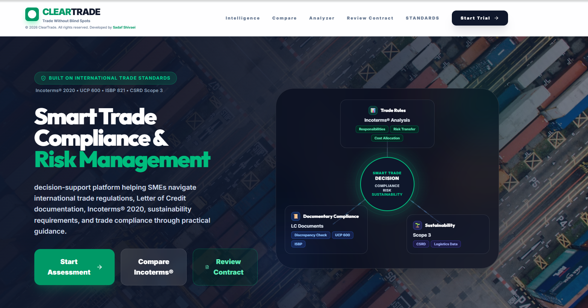

# ClearTrade
### Trade Without Blind Spots

**An AI-driven decision-support platform that helps SMEs choose the right Incoterms® 2020 rule, see their real risk and carbon exposure, and stay compliant with UCP 600 / ISBP 821 / CSRD before a contract is ever signed.**

`Incoterms® 2020` · `UCP 600` · `ISBP 821` · `CSRD — Scope 3`

---

## 1. The Problem

Most SMEs negotiate international trade contracts the same way they always have: **by experience, not by structure**. That habit is quietly expensive.

- **Hidden liabilities.** The Incoterm printed on a sales contract defines exactly where risk, cost, and insurance obligations move from seller to buyer. Get it wrong — for example under CPT/CFR, where risk transfers long before the cargo is actually delivered — and a company can end up paying for damaged or lost goods it never agreed to be responsible for.
- **Documentary friction.** A mismatch between the chosen Incoterm and a company's shipping paperwork is one of the most common causes of documentary discrepancies under UCP 600 / ISBP standards — leading to port delays, demurrage charges, and stalled letter-of-credit payments.
- **A sustainability blind spot.** Terms such as EXW hand the entire transport chain to the buyer — which also means the seller loses any legal standing to see, let alone report, the carbon data generated along that chain. As the EU's CSRD pushes Scope 3 emissions reporting further down the supply chain, that "default" choice becomes a real compliance risk, not just an operational one.
- **A trust gap.** SMEs are often unwilling to share detailed emissions or shipment data with counterparties or platforms, out of concern for commercial confidentiality — which means any useful tool has to work from *non-sensitive* contractual parameters, not from proprietary company data.

None of this is a knowledge problem SMEs can easily buy their way out of — specialist trade-finance and logistics consultants are expensive, and most SMEs make these calls without one. ClearTrade is built to close that gap: it translates dense legal and logistics theory into a short guided wizard, so a company can understand the consequences of an Incoterm decision *before* it's written into a contract.

## 2. Why I'm Building This

I spent several years as a **Documentary Credit (Letters of Credit) Manager** at a provincial branch network of **Bank Mellat**, and across two separate periods my portfolio delivered the highest profitability of any unit in the bank.

That result didn't come from chasing the largest corporate accounts. It came from a deliberate focus on **mid-sized exporters and importers** — companies with genuinely good products, but limited in-house knowledge of international trade mechanics. I worked with them the way a trade advisor would: helping them navigate Incoterms, documentary credit requirements, and the practical tools of cross-border trade, rather than just processing their paperwork. The result was a real two-sided win — the businesses grew into confident, active international traders and became loyal bank customers, and the bank's own credit portfolio grew alongside them.

That experience shaped a conviction I still hold: **mid-sized companies are the backbone of trade growth.** With the right guidance, they become long-term, active participants in international markets. Without it, they misuse trade instruments, absorb losses they never needed to take, and are quietly pushed out of international trade altogether — a loss not just for the company, but for the wider economy.

ClearTrade is my attempt to make that guidance scalable. Instead of one advisor helping one company at a time, an AI-driven wizard encodes the same reasoning — Incoterm selection, risk allocation, documentary readiness, and carbon/CSRD exposure — into a tool any SME can use directly, without needing to hire a specialist first.

## 3. What ClearTrade Does

ClearTrade is a **web-based decision-support artifact**, developed using a **Design Science Research (DSR)** methodology, built around three connected pillars: Incoterms selection, sustainability/CO₂ control, and banking documentation.

### 🧭 Analyzer — the guided wizard
A step-by-step questionnaire — role (buyer/seller), transport mode, who bears shipping risk, who controls loading — that narrows down to a recommended Incoterm without requiring the user to read the ICC rulebook first.

  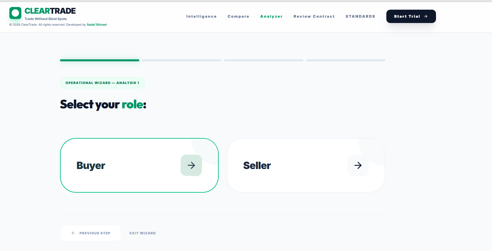
  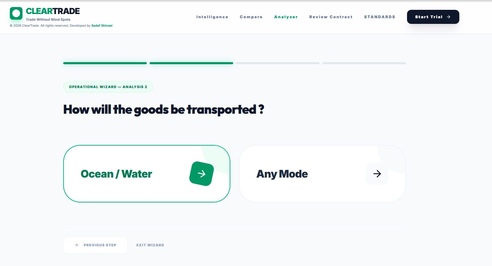
  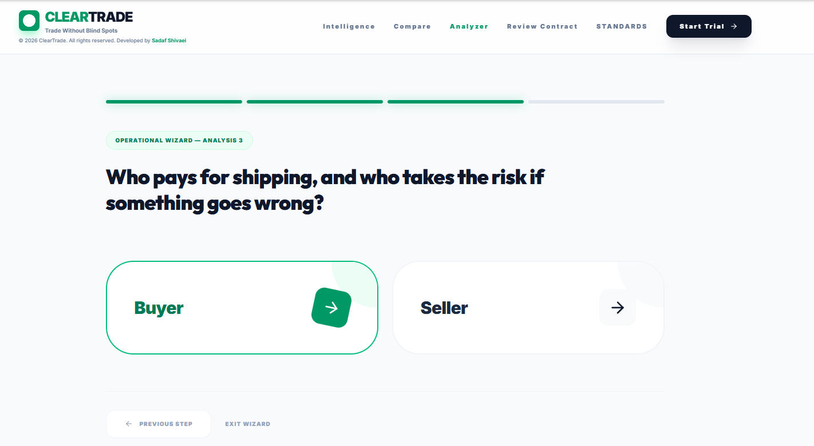

### ⚖️ Strategic Recommendation — risk & responsibility, visualized
Once a term is recommended (e.g. **FAS – Free Alongside Ship**), ClearTrade shows exactly where legal risk, financial cost, and insurance obligation transfer along the logistics chain — stage by stage, seller-controlled vs. buyer-controlled.

  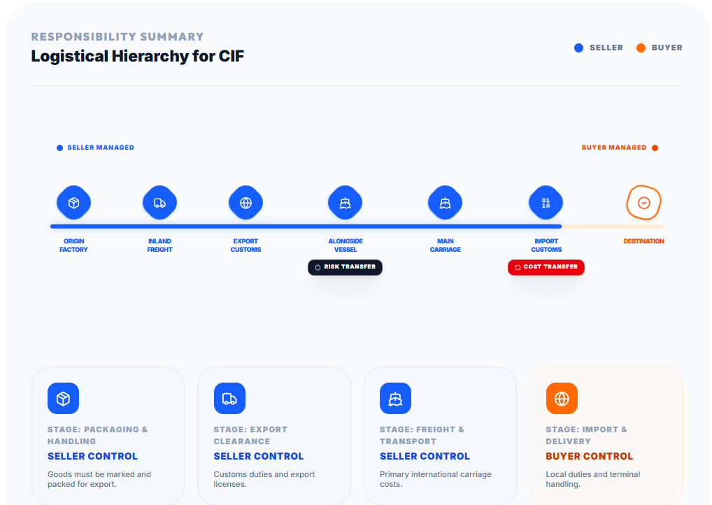
  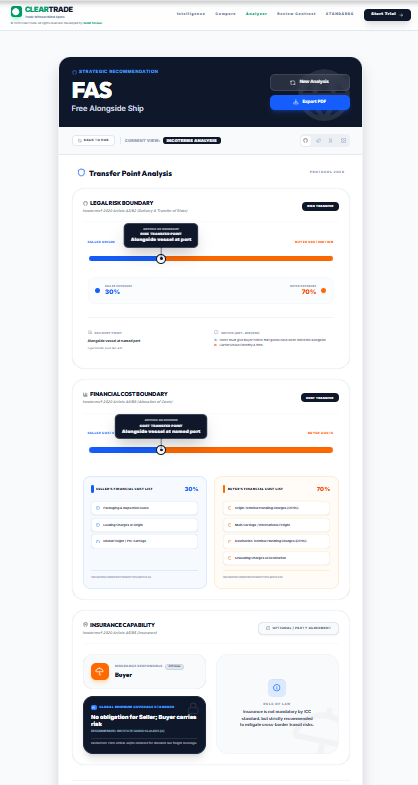

Each recommendation also comes with **expert-style strategic insights** — plain-language guidance on when the chosen term is a good fit and where its weak points are.

  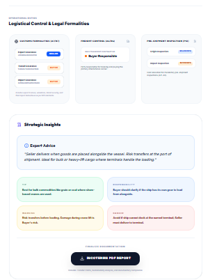

### 🌱 Sustainability & Carbon Control Analytics
Based on the selected Incoterm and applicable freight regulations, ClearTrade maps **which party actually holds the authority** to access carbon and logistics data — the prerequisite for any credible **Scope 3 / GHG Protocol** reporting — and lays out a simplified **CSRD compliance roadmap**, plus concrete "greener Incoterm" recommendations (e.g. moving from EXW to FCA, or from maritime E/F terms to CPT/CIP) to close the sustainability blind spot.

  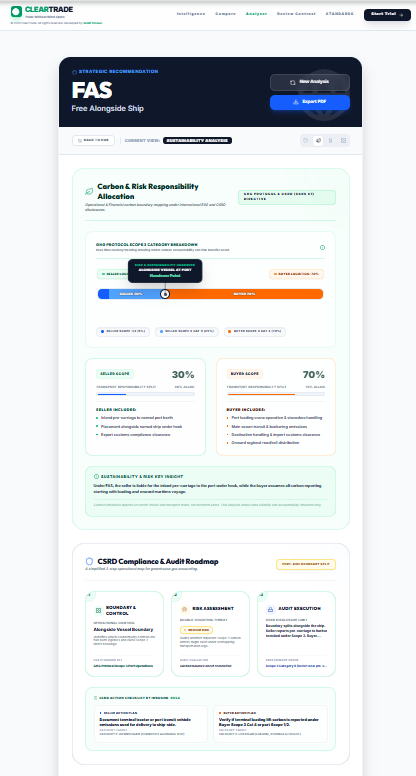
  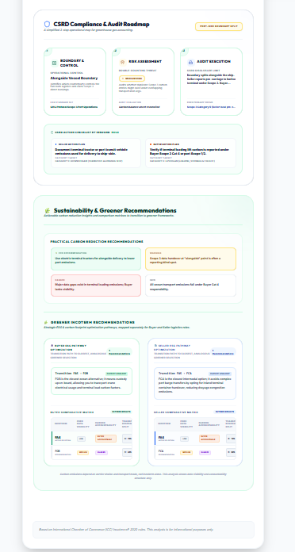

### 📄 Documentary Compliance
A dedicated view listing the **minimum mandatory documents** for both buyer and seller under the selected Incoterm, cross-referenced against **UCP 600 / ISBP** standards, plus the underlying ICC guidance — built to reduce documentary discrepancies before a letter of credit is ever presented at a bank.

  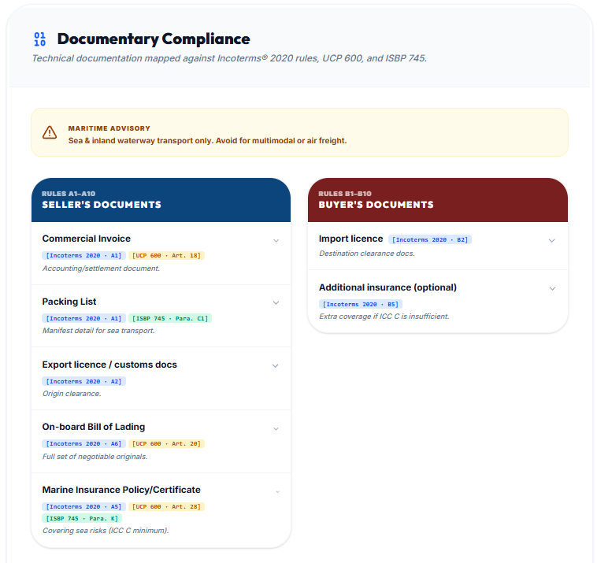

### 🔍 Intelligence Hub
A control desk that lets users jump straight into any single analytics engine — Incoterms matrix, sustainability protocols, or documentary framework — without repeating the whole wizard.

  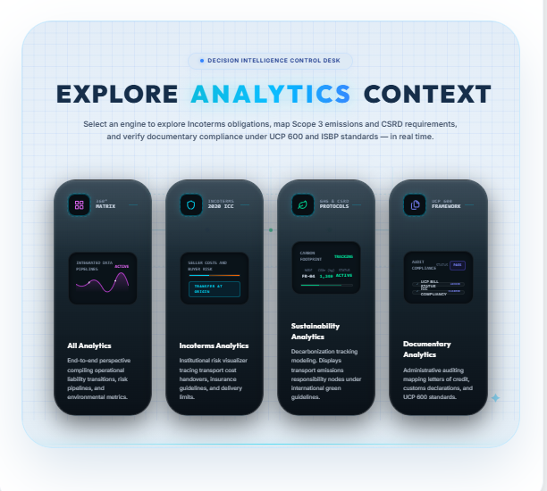

### ⇄ Compare Mechanics
Select 2–4 Incoterms and compare them side by side across risk transfer, carbon control, and documentary burden — built for the moment a company is negotiating and weighing real alternatives, not just looking up one definition.

  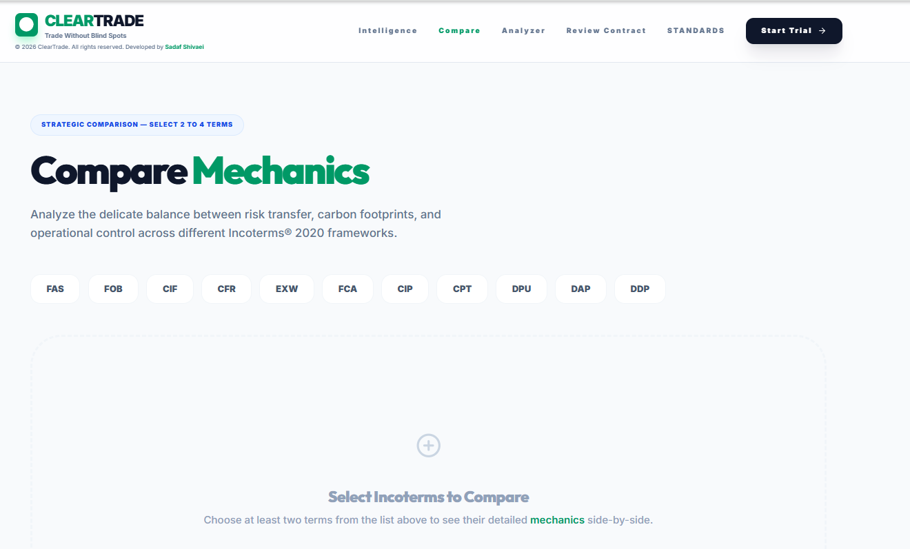
  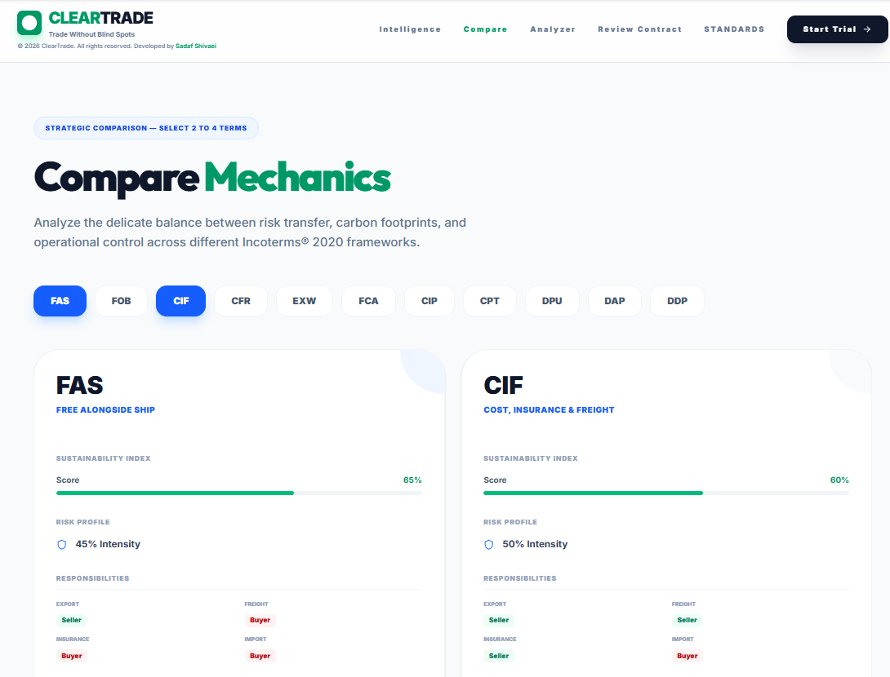

### 🛡️ Review Contract
An automated auditing tool: upload or paste a contract/logistics clause, and ClearTrade checks it against Incoterms® 2020 risk handovers, Scope 3 / green logistics requirements, and UCP 600 documentary standards — flagging mismatches, mispriced risk, and compliance gaps before they become disputes.

  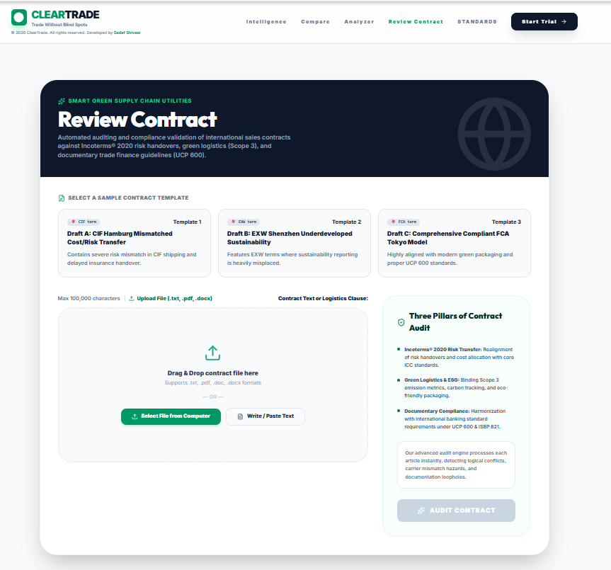

## 4. Objectives

1. **Design and develop** an AI-driven, user-friendly decision-support platform that lets SMEs identify the correct Incoterms® 2020 rule through a short, guided question flow — reducing reliance on costly logistics experts at the initial decision stage.
2. **Deliver analytics for every selected Incoterm** across three areas: transport risk allocation, carbon control & sustainability (ESG/CSRD-aligned), and documentary requirements (UCP 600-aligned).
3. **Provide a comparative decision framework**, letting users evaluate 2–4 Incoterms side by side, plus any additional decision-support features with strong potential for international trade digitalization.

## 5. Standards This Platform Is Built On

- **Incoterms® 2020** (ICC)
- **UCP 600** — Uniform Customs and Practice for Documentary Credits
- **ISBP 821** — International Standard Banking Practice
- **EU CSRD** — Corporate Sustainability Reporting Directive (Scope 3 emissions)
- **GHG Protocol**

---

Developed by **Sadaf Shivaei**

